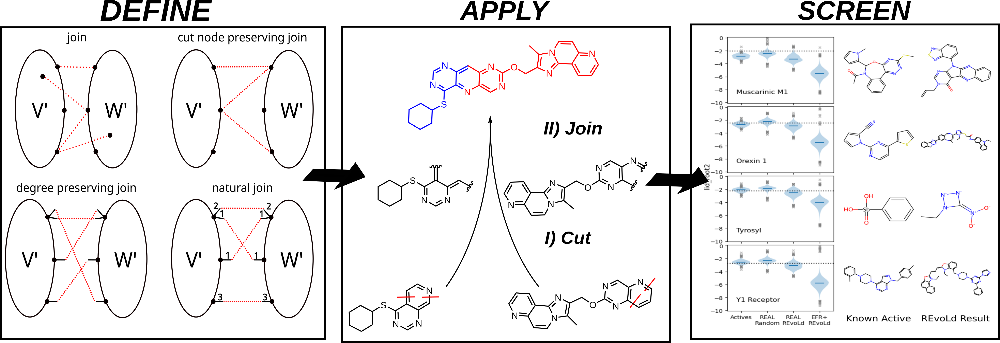

# Crossover Operators for Molecular Graphs with an Application to Virtual Drug Screening



For more details, see [here](https://chemrxiv.org/engage/chemrxiv/article-details/66e43e3a12ff75c3a138bca8).

## Structure

The main scripts to cut molecules and join molecular fragments can be found in the root directory.

## Prerequisites

_NOTE:_ This works relies on [MongoDB](https://www.mongodb.com/) and [Gurobi](https://www.gurobi.com/). Additional licenses may be required.

Core developement was done on Python 3.11.5
The following Python packages are needed:

```
- networkx = 3.3
- Pebble = 5.0.7
- more-itertools = 10.3.0
- gurobipy = 11.0.3
- rdkit = 2023.9.1 
- tqdm = 4.66.1
- pymongo = 4.8.0
- matplotlib = 3.8.1
- numpy = 1.26.1
- pandas = 2.1.2
```

## Usage

Prepare your data as a newline delimited SMILES textfile.

To use the cut-and-join algorithm:

1. edit the _util.py_ to suit your MongoDB Installation.

2. run cut.py to generate fragments and save them to the DB
  ```bash
  python cut.py <SMILES file>
  ```

3. run generate_SMARTS.py to save the SMARTS to the DB
  ```bash
  python generate_SMARTS.py
  ```

4. run join.py to generate the recombinants and save them to the DB
  ```bash
  python join.py
  ```
